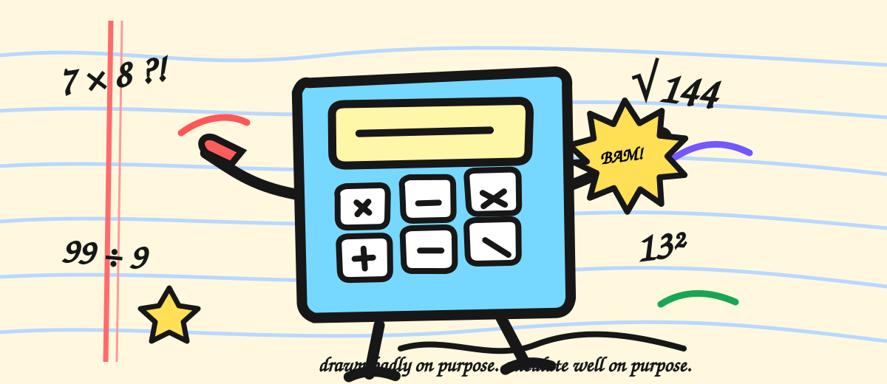

# MATH-Warefare: Omega Ultra

**A fast mental-math battle game where correct calculations become combos, shields, boosts, boss damage, and XP.**



## Play it

**▶ [PLAY THE LIVE GAME](https://hustlenix.github.io/math-warfare/)**

No account is required. Enter a callsign, choose a difficulty and battle type, pick your operations, and start calculating.

## What is this?

I started MATH-Warefare because I kept losing exam time on calculations that should have been automatic. I wanted practice to feel less like another worksheet, so I turned it into a small arcade battle.

The game deliberately looks like a messy school notebook / MS Paint drawing instead of a polished dashboard. Equations live on ruled paper, controls are crooked, labels look taped on, and the main artwork is a rough calculator character fighting math problems.

## Features

- **Classic + Time Attack battles** — play a fixed number of questions or survive a 60/90/120 second blitz.
- **Three difficulty modes** — BASIC, PRO, and GOD/CHAOS change number ranges, timing, and visual pressure.
- **Four selectable operations** — addition, subtraction, multiplication, and exact division can be mixed in one run.
- **Combo combat system** — streaks increase XP multipliers, award shields, and drop random 2× / reveal / bomb boosts.
- **Boss equations + revenge rounds** — every 10th question becomes a boss; misses in Classic give one short redemption attempt.
- **Progression + score history** — callsigns keep local XP, ranks, personal bests, last-battle deltas, and a local leaderboard.
- **Game feel** — synthesized WebAudio effects, rising combo pitch, hit-stop, floating XP, confetti, screen shake, memes, pause, and low-time warnings.

## Controls

| Action | Control |
| --- | --- |
| Submit answer | **Enter** |
| Pause / resume | **Esc** |
| Sound | Speaker button |
| Mobile play | Tap the answer field and use the numeric keyboard |

## Quick start

The easiest way to try the project is the live demo above.

To run it locally, use **Node.js 20+**:

```bash
git clone https://github.com/Hustlenix/math-warfare.git
cd math-warfare
npm install
npm run dev
```

These commands run the Vite app directly from this project folder. You can also run the wrapper scripts from the repository root.

For a production build:

```bash
npm run build
```

## How it works

The game is intentionally split into small modules instead of keeping everything in one HTML file.

- `src/engine/questions.js` generates questions and boss variants.
- `src/engine/state.js` owns battle state, timers, shields, boosts, and transitions.
- `src/engine/scoring.js` calculates multipliers, XP, ranks, boss bonuses, and revenge rewards.
- `src/fx/audio.js` synthesizes sound effects in the browser with WebAudio.
- `src/fx/chaos.js` handles GOD-mode screen effects.
- `src/api/leaderboard.js` stores local battle history and provides the leaderboard layer.
- `src/api/memes.js` fetches/falls back to safe meme reactions.
- `src/main.js` is the DOM/game-flow controller.
- `src/styles.css` is the custom hand-drawn visual system.

The battle flow is a small state machine: **question → feedback → next question**, with a **revenge** state for Classic misses. Time Attack uses one battle clock that keeps running between questions instead of resetting per question.

## Visual design

The current visual system was rebuilt after Stardance ship feedback that the original neo-brutalist CSS looked too similar to common AI-generated sites.

The replacement is intentionally specific to this game:

- graph-paper / ruled-paper textures
- rough black outlines and uneven radii
- slightly rotated cards and controls
- tape-like section labels
- hand-written display typography
- an original MS-Paint-style calculator battle illustration
- no glassmorphism, generic SaaS dashboard layout, or component-library look

The layout is still responsive and includes `prefers-reduced-motion` handling.

## Project structure

```text
.
├── .github/workflows/deploy.yml   # GitHub Pages build/deploy
├── package.json                   # root wrapper scripts
└── math-warfare/
    ├── public/
    │   └── paint-battle.svg       # original hand-drawn hero artwork
    ├── src/
    │   ├── api/
    │   ├── engine/
    │   ├── fx/
    │   ├── main.js
    │   └── styles.css
    ├── index.html
    ├── package.json
    └── vite.config.js
```

## Deployment

Every push to `master` runs the GitHub Actions workflow in `.github/workflows/deploy.yml`:

1. install dependencies with `npm ci`
2. build the Vite project
3. upload `math-warfare/dist`
4. deploy it to GitHub Pages

Live URL: **https://hustlenix.github.io/math-warfare/**

## Known limitations

- The “GLOBAL (SIM)” board is intentionally labeled as simulated; local progress is the real persistent score history in the browser.
- Progress is local to the browser/device unless a future backend is added.
- The game currently focuses on arithmetic speed rather than a full school syllabus.

## Credits & build notes

- Built with **Vite** and vanilla JavaScript modules.
- Celebration particles use **canvas-confetti**.
- Meme reactions use external meme data with fallbacks.
- AI/LLM assistance was used for coding support, review, troubleshooting, and deployment. The project structure, game direction, iteration decisions, and Stardance submission are maintained in this repository.
- The current visual system and `paint-battle.svg` were made specifically for MATH-Warefare rather than copied from a UI template.

## Why I built it

During exam practice I noticed that knowing the difficult method was not enough: slow basic calculations still cost time. MATH-Warefare is my attempt to make repetition fast, competitive, and weird enough that I actually want to do another round.
